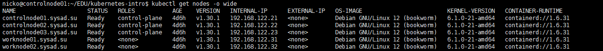
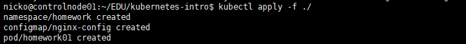
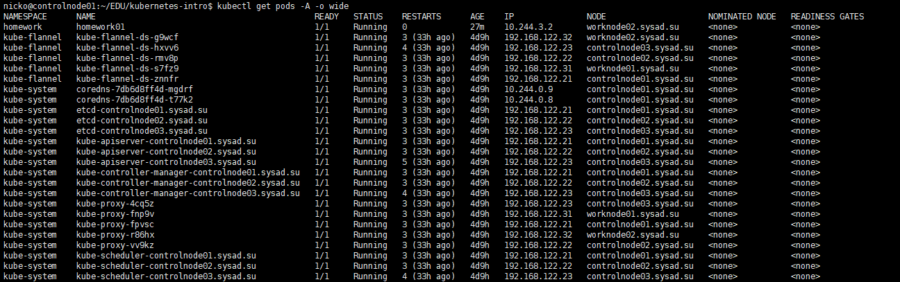
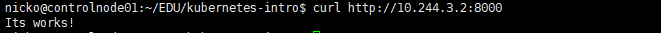

# Домашнее задание 1.

На виртуальных машинах под управлением гипервизора KVM создан кластер Kubernetes в составе трёх управляющих нод и двух рабочих нод:

Командой kubectl `apply -f ./`  создаётся namespace `homework`   и  pod `homework01`, содержащий сервис nginx:

В результате общий список подов выглядит следующим образом:

Созданный под расположен на ноде `worknode02.sysad.su` и имеет адрес `10.244.3.2`

Проверить работу сервиса nginx можно командой `curl http://10.244.3.2:8000`

